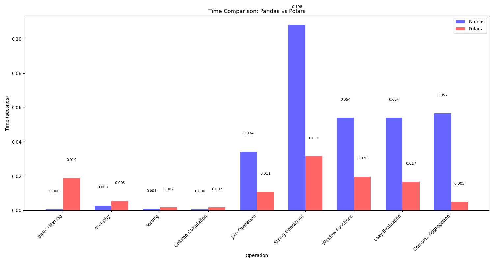
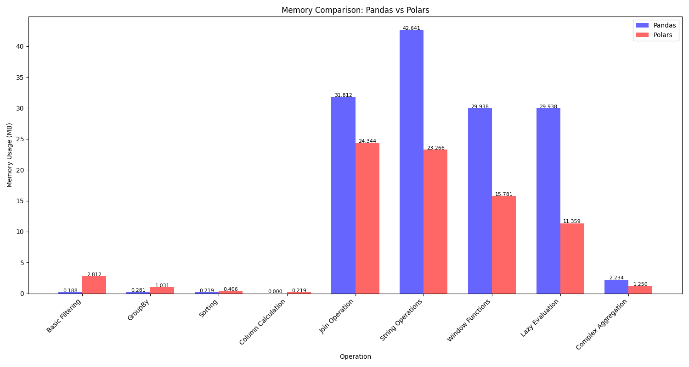

# Polars vs Pandas Performance Comparison

This project provides a comprehensive performance comparison between Polars and Pandas libraries. The comparison includes various operations on both small and large datasets, measuring both execution time and memory usage.

## Overview

The comparison evaluates the performance of Polars and Pandas on:
- Small datasets (seaborn's tips dataset)
- Large synthetic datasets (500,000 rows)

## Key Metrics
- Execution time of operations
- Memory usage during operations

## Setup

1. Create a virtual environment (recommended):
```bash
python -m venv venv
source venv/bin/activate  # On Windows: venv\Scripts\activate
```

2. Install dependencies:
```bash
pip install -r requirements.txt
```

3. Run the comparison:
```bash
python comparison.py
```

## Operations Compared

### Basic Operations (on small dataset)
- Basic filtering
- Grouping and aggregation
- Sorting
- Column manipulation

### Advanced Operations (on large dataset)
- Join/Merge operations
- String operations
- Window functions
- Lazy vs eager evaluation (Polars specific)
- Complex aggregation with multiple operations

## Results and Visualization

The script generates:
1. Time comparison chart (`time_comparison.png`)
2. Memory usage comparison chart (`memory_comparison.png`)
3. Detailed results CSV (`comparison_results.csv`)

### Visual Results

#### Execution Time Comparison


The time comparison chart shows the execution time in seconds for each operation. Lower bars indicate better performance. As shown in the visualization, Polars generally outperforms Pandas in most operations, especially for operations on larger datasets.

#### Memory Usage Comparison


The memory usage chart displays the memory consumption in MB for each operation. Lower memory usage indicates more efficient memory management. The visualization demonstrates Polars' memory efficiency compared to Pandas for most operations.

### Key Findings

Based on the benchmark results:
- Polars is approximately 2-3x faster than Pandas for most operations
- Polars uses significantly less memory, particularly for large dataset operations
- The performance gap widens as dataset size increases
- Polars' lazy evaluation provides additional performance benefits for complex operations

## Understanding the Results

The comparison provides insights into:
- Which library performs better for specific operations
- Memory efficiency differences between the libraries
- Performance characteristics with different dataset sizes
- The impact of lazy evaluation in Polars

## Sample Metrics

For each operation, the following metrics are captured:
- Execution time in seconds
- Memory usage in MB
- Relative performance ratio (Pandas vs Polars) 